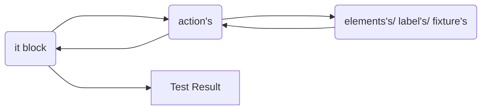

<h1 >Welcome to CypressCookieCutter
<a href="https://www.ignicube.com/"></a></h1>

<div >Rapidly create modern ventures, and start and begin coding quickly with an as of now pre-configured extend. Whereas utilizing this CypressCookieCutter you and your group can focus more on coding, and less stress around setup. This CypressCookieCutter is full of valuable plugins as of now designed, and much more! Great good fortune!
</div>
</br>

## Step 1. Prerequisites

Node.js must be installed before installing Cypress. NodeJS is a runtime environment that helps to create server-side JavaScript applications.

### 1.1 Installing Node.js

You can use the link below to install Node.js. Then click the Windows installer .msi file for installation. https://nodejs.org/en/download

Hopefully, npm installed with Node.js there is only need to update NPM using following command

```sh
npm install -g npm

```

Verify Node.js and npm installed perfectly. If system prompt version, then you are good to go to next step

```sh
node -v
npm -v
```

## Step 2. Setting up your project with few commands

Keep in mind, `my-cypress` name of your project folder name but you can update while cloning this repository

```sh
npx git@github.com:Ignicube/CypressCookieCutter.git my-cypress
```

## 2.1 Install dependencies</br>

First, move into the folder.

```sh
cd my-cypress

```

npm (node package manager) will automatically install all dependencies

```sh
npm install

```

## 2.2 Create a new project

`project` refers to your project (name).

```sh
npm run add-project
```

This command will prompt you for your:

Project name? </br>
What is the baseUrl for this project? e.g. (www.mydomain.com) </br>
Do you want configure TestRail? (y/N) yes will create test `TestRail configuration`</br>

## Setup almost Done!

The command from above would create the following structure and inject new scripts in package.json. Rest of cypress project will remain as it is

```
- core/pageObject
  - actions/
    - generalActions.js
    - pageActions.js
  - elements/
    - pageElements.js
  - labels/
    - pageLabels
    elements.js
    fixture.js
    labels.js
    pages.js
- e2e/
    - default.cy.js
- plugins/
    - index.js
- cypress.env.json
- cypress.config.js
```

This file structure explains below.

| file structure     | description                                             |
| ------------------ | ------------------------------------------------------- |
| `core/ pageObject` | contains `objects modal` folder and file                |
| `actions/`         | contains `action's` on page (e.g. verify, add, edit)    |
| `elements/`        | contains `element's` on page                            |
| `labels/`          | contains `label's` for elements                         |
| `elements.js`      | combined `element's` of system will export in this file |
| `fixture.js`       | combined `element's` of system will export in this file |
| `labels.js`        | combined `label's` of system will export in this file   |
| `pages.js`         | combined `action's` of system will export in this file  |

Best practice: create `separate files for each page/ section` e.g. actions, elements, labels

Here is high level flow that how code structure interact with each other



### General actions

There are numerous predefined action's (e.g. input, Api request, drag & drop) accessible, by utilizing these action's your code will be rapid and consistent. Some examples are listed below

```js
const login = () => {
  return cy.adminLogin(Cypress.env('username'), Cypress.env('password'))
}
const clickButtonUsingLabel = (label) => {
  return cy.contains(label).should('be.visible').click({
    force: true,
  })
}
const clickButtonUsingLocator = (locator) => {
  return cy.get(locator).should('be.visible').click({
    force: true,
  })
}
const typeInDropdownInput = (dropdown_locator, text) => {
  return cy.get(dropdown_locator).click().type(`${text}{enter}`, {
    delay: 100,
  })
}
const dragandDropUsingXpath = (value, value2) => {
  const dataTransfer = new DataTransfer()
  cy.xpath(value).trigger('dragstart', {
    dataTransfer,
  })

  cy.get(value2).trigger('drop', {
    dataTransfer,
  })
}
const clickButtonUsingXpath = (value) => {
  cy.xpath(value).click()
}
const canvasDragandDropUsingXpath = (value, x, y) => {
  cy.xpath(value)
    .trigger('mousedown')
    .trigger('mousemove', {
      clientX: x,
      clientY: y,
    })
    .trigger('mouseup')
}
.
.
const generalActions = {
  login,
  clickButtonUsingLabel,
  clickButtonUsingLocator,
  typeInDropdownInput,
  clickButtonUsingXpath,
  canvasDragandDropUsingXpath,
  dragandDropUsingXpath,
}

export default generalActions
```

Usage:

```js
import * as pages from '../pages'

describe('Visit', () => {
  it('Visit', () => {
    pages.generalActions.clickButtonUsingLocator(elements.pageElements.googleInput)
    pages.generalActions.typeInInput(elements.pageElements.googleInput, data.defaultData.input)
    pages.generalActions.clickButtonUsingLabel(labels.pageLabels.googleSearchLabel)
  })
})
```

In `fixture > project > projectENV.json` define your `baseUrl` and other URLs per each environment.

Preview

```json
{
  "staging": {
    "baseUrl": "https://example.com"
  },
  "release": {
    "baseUrl": "https://example.com"
  },
  "production": {
    "baseUrl": "https://example.com",
    "admin": "https://example.com/admin"
  }
}
```

Usage:

```js
import { projectENV } from '../../../support/helpers'

describe('Should visit admin', () => {
  it('Visit', () => {
    cy.visit(projectENV.admin)
  })
})
```

`projectENV` will always return the URL from the current set environment, which in this case, is `production`.

### fixtures/credentials.json

Here is the place to define your user's list, etc. users list for your tests.

By default, you can see

Preview

```json
{
  "staging": {
    "sampleUser1": {
      "name": "User name",
      "email": "test@cypress_template_test.com",
      "password": "user password"
    }
  },
  "release": {
    "sampleUser2": {
      "name": "User name",
      "email": "test@cypress_template_test.com",
      "password": "user password"
    }
  }
}
```

Usage:

```js
import { projectENV, credentials } from '../../../support/helpers'

describe('Should visit admin', () => {
  it('Visit and log in ', () => {
    cy.visit(projectENV.admin)
    cy.logIn(credentials.sampleUser2)
  })
})
```

<h1 >Checkout a few plugins recorded underneath</h1>
<div >Plugins empower you to tap into, adjust, or expand the inside behavior of Cypress, some plugins are already enabled</div>

## Cypress Testrails Reporting-Embedded Plugin

- If you run multiple spec (test) files that are part of the same suite, the test results are combined under a single test run.
- Results are reported immediately after single test execution (real-time reporting)
- Test run would be closed after last spec(test) file has been finished
- Possibility to upload screenshots for failed and retried test cases - optional (allowFailedScreenshotUpload: true)
- Multi suite project support (set suiteId=1 in cypress.env.json or set it as a part of runtime environment variables as TestRailSuiteId=1)
- Reporting retest status of a test cases - handy in terms of marking tests as flaky (test is reported with retest status for the first try and after second try it passes)
  </br>Note: cypress retry logic must be enabled for this feature `retry logic is enabled in below configuration`

Preview: cypress.env.json

```json
{
  "TestRail": {
    "domain": "my-company.TestRail.io",
    "username": "myUser",
    "password": "myPwd",
    "projectId": "P2",
    "milestoneId": "9",
    "suiteId": "S3",
    "runName": "Cypress Run",
    "closeRun": false,
    "screenshots": true
  },
  "retries": {
    "runMode": 1,
    "openMode": 0
  }
}
```

<div >Only need to add domain/ host, username, password and project id, each thing is done</div>

Your Cypress tests(it block) should include the ID of your TestRail test case. Make sure your test case IDs are distinct from your test titles:

```js
// Good:
it("C1 C2 Can authenticate a valid user", ...
it("Can authenticate a valid user C12", ...

// Bad:
it("C1Can authenticate a valid user", ...
it("Can authenticate a valid userC2", ...
```

## Cypress File Upload-Embedded Plugin

Presently, let's see how we are able to really test something. Uncovered command has signature like

Drag-n-drop component, this function is already available in general action

```js
const uploadFileUsingLocatorDandD = (locator, path) => {
  return cy.get(locator).attachFile(path, {
    action: 'drag-drop',
  })
}
```

Attaching multiple files

```js
cy.get('[data-cy="file-input"]').attachFile(['myfixture.json', 'myfixture.json'])
```

## Cypress-XPath-Embedded Plugin

Type cy. will have XPath command, at some point it's troublesome to discover element's on web than XPath will makes a difference

Usage:

```js
it('XPath usage', () => {
  cy.xpath('//body/div[1]/div[2]/div[1]/img[1]').should('be.visible')
})
```

If using TypeScript, add cypress-xpath to the list of types to be loaded in tsconfig.json

```json
{
  "compilerOptions": {
    "types": ["cypress", "cypress-xpath"]
  }
}
```

## Mochawesome Reports-Embedded Plugin

Cypress has gained significant popularity as a modern end-to-end testing framework due to its simplicity, speed, and reliability. However, while Cypress Cookies Cutter provides detailed test results by default, enhancing the reporting capabilities can provide better insights into test execution and results. One such tool that can significantly improve your testing workflow is the Cypress Mochawesome Reporter.

### How to run mochawesome reports?

Cypress cookies cutter doesn't require any additional setup; it may be used in headless mode.

```sh
npx cypress run

```

After running the cypress in headless mode, your Cypress directory will contain a folder entitled report.

```
- core/
- e2e/
- plugins/
- reports/
  - html
    - assets/
    - index.html
- support/
```

index.html is the combined report of each test case.

### Customizing Your Report

The cypress cookies cutter provides various options to customize your HTML report according to your preferences. Here’s an example of how you can customize your report:

```js
const { defineConfig } = require('cypress')

module.exports = defineConfig({
  reporter: 'mochawesome',
  reporterOptions: {
    reportDir: 'cypress/results', //can change report directory
    overwrite: false,
    html: false,
    json: true,
  },
  .
  .
  .
})
```

### Additional Options

`embeddedScreenshots` Embeds external screenshots into HTML using base64 encoding.</br>
`ignoreVideos` Ignores copying videos recorded by Cypress and excludes them from the report.</br>
`videoOnFailOnly` Adds videos only to tests with failures.</br>
`quiet` Silences console messages.</br>
`saveAllAttempts` Saves screenshots of all test attempts.</br>
`debug` Creates a log file with debug data.</br>

## Verify Download-Embedded Plugin

Verify downloaded plugin makes a difference to confirm downloaded records, no matter what is the extension of the file. By using these variations of the `cy.verifyDownload` command with different options, you can effectively confirm and validate downloaded records regardless of the file extension or partial filename.

In your test, you'll utilize it like this

```js
cy.verifyDownload('image.png')

// verify download by file extension or partial filename
cy.verifyDownload('.png', { contains: true })
cy.verifyDownload('pic', { contains: true })

// or increase timeout
cy.verifyDownload('archive.zip', { timeout: 25000 })

// or increase timeout and interval pooling
cy.verifyDownload('project.pdf', { timeout: 25000, interval: 600 })
```

## CI with GitHub Actions-Embedded Plugin

Once you run `npm run add-project` on over 2.2 steps then system will inquire for a confirmation.<br><br> Do you want integrate github action? **(y/N)** <br>
Once you type y and press enter then a file will be made on root named `.github/workflow/main.yml`
This is very basic configuration of CI with cypress automation, you'll be able modify as per your necessities. This gitHub action will run cypress test on every [push]

```yaml
name: Cypress test (push)
on: [push]
jobs:
  Cypress-Test:
    runs-on: ubuntu-latest
    steps:
      - name: Checkout GitCode
        uses: actions/checkout@v4

      - name: Run Cypress Test
        uses: cypress-io/github-action@v4
        with:
          command: npx cypress run
          browser: chrome
```

### Run daily triggers

If you want to trigger your test run on particular or day by day you'll incorporate a plan run with time in main.yml or can add a new file in workflow the folder . Additionally you'll be able alter browser setting as underneath

```yaml
name: Cypress test (scheduled)
on:
  workflow_dispatch:
  schedule:
    - cron: '00 04 * * *' # runs daily At 04:00 AM
jobs:
  Cypress-Test:
    runs-on: ubuntu-latest
    steps:
      - name: Checkout GitCode
        uses: actions/checkout@v4

      - name: Run Cypress Test
        uses: cypress-io/github-action@v4
        with:
          command: npx cypress run
          browser: electron
```

## Wailuntil plugin-Embedded Plugin

Use this plugin to wait for everything not expected by Cypress wait. This can be a very useful plugin that may quicker your test.

Usage:

```js
// wait until a cookie is set
cy.waitUntil(() => cy.getCookie('token').then((cookie) => Boolean(cookie && cookie.value)))

// wait until a global variable has an expected value
cy.waitUntil(() => cy.window().then((win) => win.foo === 'bar'))

// sync function works too!
cy.waitUntil(() => true)

// with all the available options
cy.waitUntil(() => cy.window().then((win) => win.foo === 'bar'), {
  errorMsg: 'This is a custom error message', // overrides the default error message
  timeout: 2000, // waits up to 2000 ms, default to 5000
  interval: 500, // performs the check every 500 ms, default to 200
})
```

### Arguments

Pass in an options object to change the default behavior of cy.waitUntil().

| Option             | Type             | Default            | Description                                                                                                            |
| ------------------ | ---------------- | ------------------ | ---------------------------------------------------------------------------------------------------------------------- |
| errorMsg           | string/ function | Timed out retrying | The error message to write. If it's a function, it will receive the last result and the options passed to cy.waitUntil |
| timeout            | number           | 5000               | Time to wait for the checkFunction to return a truthy value before throwing an error.                                  |
| interval           | number           | 200                | Time to wait between the checkFunction invocations.                                                                    |
| description        | string           | waitUntil          | The name logged into the Cypress Test Runner.                                                                          |
| logger             | function         | Cypress.log        | A custom logger in place of the default Cypress.log. It's useful just for debugging purposes.                          |
| log                | boolean          | true               | Enable/disable logging.                                                                                                |
| customMessage      | string           | undefined          | String logged after the options.description.                                                                           |
| verbose            | string           | false              | If every single check result must be logged.                                                                           |
| customCheckMessage | string           | undefined          | Like customMessage, but used for every single check. Useless if verbose is not set to true.                            |

## Mobile Command/ Map-Embedded Plugin

Cypress mobile commands/ map plugin specifically designed to facilitate mobile testing by providing additional commands tailored for mobile interactions. This plugin extends Cypress with commands that simulate common mobile gestures and behaviors, making it easier to write comprehensive end-to-end tests for mobile applications.

Some of the commands provided by cy-mobile-commands may include:

- `cy.mobileSwipe()` This command allows you to simulate swiping gestures on mobile devices, which are commonly used for navigation or scrolling within mobile applications.
- `cy.mobileTap()` Use this command to simulate tapping on elements in your mobile application, similar to how users interact with touchscreens.
- `cy.mobileScroll()` This command enables you to simulate scrolling behavior within your mobile application, which is useful for testing scrolling lists or dynamic content.
- `cy.mobilePinch()` Use this command to simulate pinch gestures, which are often used for zooming in or out on mobile devices.
- `cy.mobileRotate()` This command allows you to simulate device rotation, which is essential for testing how your application responds to changes in orientation.
- `cy.mobileDevice()` This command sets the viewport to emulate a specific mobile device, allowing you to test your application's responsiveness across various screen sizes and resolutions.
- `cy.mobileOrientation()` Use this command to set the orientation of the device viewport, allowing you to test how your application behaves in both portrait and landscape modes.
- `cy.mobileInput()` This command simulates typing text into input fields on mobile devices, helping you test forms and text entry functionalities.

Usage in independent test case:

```js
it('Page Swipe', () => {
  cy.get('.slider').swipe('right', 'left')
  cy.get('.slider').swipe('left', 'right')
})
it('Map', () => {
  cy.get('.map').swipe(
    { delay: 2000 },
    [
      [100, 200],
      [65, 35],
    ],
    [
      [140, 300],
      [50, 500],
    ],
  )
})
```

## Cypress if-Embedded Plugin

In the context of Cypress, the end-to-end testing framework for web applications, handling conditional logic directly within your tests might require you to use JavaScript's standard if-else statements. However, if you're looking for plugins or methods to handle conditional scenarios more elegantly.

Let's say, there is a dialog that might sometimes be visible when you visit the page. You can close it by finding it using the cy.get command followed by the .if() command. If the dialog really exists, then all commands chained after .if() run. If the dialog is not found, then the rest of the chain is skipped.

```js
cy.get('dialog#survey').if().contains('button', 'Close').click()
```

### else Command

You can chain .else() command that is only executed if the .if() is skipped.

```js
cy.contains('Accept cookies').if('visible').click().else().log('no cookie banner')
```

By default, the .if() command just checks the existence of the element returned by the cy.get command. You might use instead a different assertion, like close a dialog, callback function, combining assertion, multiple commands, within, finally, aliases and null values.

## Brief

No configuration needed with a clean, intuitive, and same project structure we keep everyone consistent across all projects.
Fully object oriented and well structured. To achieve testing features that are quick, dependable, and simple to troubleshoot, numerous plugins are incorporated.
