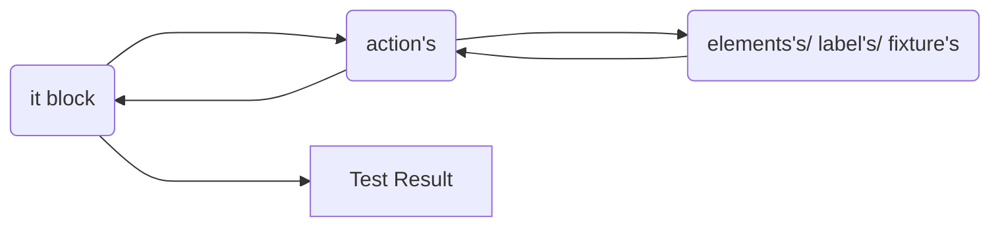

<h1 >Welcome to CypressCookieCutter
<a href="https://www.ignicube.com/"></a></h1>

<div >Rapidly create modern ventures, and start and begin coding quickly with an as of now pre-configured extend. Whereas utilizing this CypressCookieCutter you and your group can focus more on coding, and less stress around setup. This CypressCookieCutter is full of valuable plugins as of now designed, and much more! Great good fortune!
</div>
</br>

## Step 1. Prerequisites

Node.js must be installed before installing Cypress. NodeJS is a runtime environment that's helps to create server-side JavaScript applications.

### 1.1 Installing Node.js

You can use the below link to install Node.js. Then click the Windows installer .msi file for installation. https://nodejs.org/en/download

Hopefully, npm installed with Node.js there is only need to update NPM using following command

```sh
npm install -g npm

```

Verify Node.js and npm installed perfectly. If system prompt version, then you are good to go to next step

```sh
node -v
npm -v
```

## Step 2. Setting up your project with few commands

Keep in mind, `my-cypress` name of your project folder name but you can update while cloning this repository

```sh
npx git@github.com:Ignicube/CypressCookieCutter.git my-cypress
```

## 2.1 Install dependencies</br>

First, move into folder.

```sh
cd my-cypress

```

npm (node package manager) will automatically install all dependencies

```sh
npm install

```

## 2.2 Create a new project

`project` refers to your project (name).

```sh
npm run add-project
```

This command will prompt you for your:

Project name? </br>
What is the baseUrl for this project? e.g. (www.mydomain.com) </br>
Do you want configure TestRail? (y/N) yes will create test `TestRail configuration`</br>

## Setup almost Done!

The command from above would create the following structure and inject new scripts in package.json. Rest of cypress project will remain as it is

```
- core/pageObject
  - actions/
    - generalActions.js
    - pageActions.js
  - elements/
    - pageElements.js
  - labels/
    - pageLabels
    elements.js
    fixture.js
    labels.js
    pages.js
- e2e/
    - default.cy.js
- plugins/
    - index.js
- cypress.env.json
- cypress.config.js
```

This file structure explains below.

| file structure     | description                                             |
| ------------------ | ------------------------------------------------------- |
| `core/ pageObject` | contains `objects modal` folder and file                |
| `actions/`         | contains `action's` on page (e.g. verify, add, edit)    |
| `elements/`        | contains `element's` on page                            |
| `labels/`          | contains `label's` for elements                         |
| `elements.js`      | combined `element's` of system will export in this file |
| `fixture.js`       | combined `element's` of system will export in this file |
| `labels.js`        | combined `label's` of system will export in this file   |
| `pages.js`         | combined `action's` of system will export in this file  |

Best practice: create `separate files for each page/ section` e.g. actions, elements, labels

Here is high level flow that how code structure interact with each other



### General actions

There are numerous predefined action's (e.g. input, Api request, drag & drop) accessible, by utilizing these action's your code will be rapid and consistent. Some examples are listed below

```js
const login = () => {
  return cy.adminLogin(Cypress.env('username'), Cypress.env('password'))
}
const clickButtonUsingLabel = (label) => {
  return cy.contains(label).should('be.visible').click({
    force: true,
  })
}
const clickButtonUsingLocator = (locator) => {
  return cy.get(locator).should('be.visible').click({
    force: true,
  })
}
const typeInDropdownInput = (dropdown_locator, text) => {
  return cy.get(dropdown_locator).click().type(`${text}{enter}`, {
    delay: 100,
  })
}
const dragandDropUsingXpath = (value, value2) => {
  const dataTransfer = new DataTransfer()
  cy.xpath(value).trigger('dragstart', {
    dataTransfer,
  })

  cy.get(value2).trigger('drop', {
    dataTransfer,
  })
}
const clickButtonUsingXpath = (value) => {
  cy.xpath(value).click()
}
const canvasDragandDropUsingXpath = (value, x, y) => {
  cy.xpath(value)
    .trigger('mousedown')
    .trigger('mousemove', {
      clientX: x,
      clientY: y,
    })
    .trigger('mouseup')
}
.
.
const generalActions = {
  login,
  clickButtonUsingLabel,
  clickButtonUsingLocator,
  typeInDropdownInput,
  clickButtonUsingXpath,
  canvasDragandDropUsingXpath,
  dragandDropUsingXpath,
}

export default generalActions
```

Usage:

```js
import * as pages from '../pages'

describe('Visit', () => {
  it('Visit', () => {
    pages.generalActions.clickButtonUsingLocator(elements.pageElements.googleInput)
    pages.generalActions.typeInInput(elements.pageElements.googleInput, data.defaultData.input)
    pages.generalActions.clickButtonUsingLabel(labels.pageLabels.googleSearchLabel)
  })
})
```

In `fixture > project > projectENV.json` define your `baseUrl` and other URLs per each environment.

Preview

```json
{
  "staging": {
    "baseUrl": "https://example.com"
  },
  "release": {
    "baseUrl": "https://example.com"
  },
  "production": {
    "baseUrl": "https://example.com",
    "admin": "https://example.com/admin"
  }
}
```

Usage:

```js
import { projectENV } from '../../../support/helpers'

describe('Should visit admin', () => {
  it('Visit', () => {
    cy.visit(projectENV.admin)
  })
})
```

`projectENV` will always return URL from current set environment, which in this case, is `production`.

### fixtures/credentials.json

Here is the place to define your user's list, etc. users list for your tests.

By default, you can see

Preview

```json
{
  "staging": {
    "sampleUser1": {
      "name": "User name",
      "email": "test@cypress_template_test.com",
      "password": "user password"
    }
  },
  "release": {
    "sampleUser2": {
      "name": "User name",
      "email": "test@cypress_template_test.com",
      "password": "user password"
    }
  }
}
```

Usage:

```js
import { projectENV, credetials } from '../../../support/helpers'

describe('Should visit admin', () => {
  it('Visit and log in ', () => {
    cy.visit(projectENV.admin)
    cy.logIn(credetials.sampleUser2)
  })
})
```

<h1 >Checkout a few plugins recorded underneath</h1>
<div >Plugins empower you to tap into, adjust, or expand the inside behaviour of Cypress, some plugins are already enabled</div>

## Cypress Testtrail Reporting-Embedded Plugin

- If you run multiple spec (test) files that are part of the same suite, the test results are combined under a single test run.
- Results are reported immediately after single test execution (real-time reporting)
- Test run would be closed after last spec(test) file has been finished
- Possibility to upload screenshots for failed and retried test cases - optional (allowFailedScreenshotUpload: true)
- Multi suite project support (set suiteId=1 in cypress.env.json or set it as a part of runtime environment variables as TestRailSuiteId=1)
- Reporting retest status of a test cases - handy in terms of marking tests as flaky (test is reported with retest status for the first try and after second try it passes)
  </br>Note: cypress retry logic must be enabled for this feature `retry logic is enabled in below configuration`

Preview: cypress.env.json

```json
{
  "TestRail": {
    "domain": "my-company.TestRail.io",
    "username": "myUser",
    "password": "myPwd",
    "projectId": "P2",
    "milestoneId": "9",
    "suiteId": "S3",
    "runName": "Cypress Run",
    "closeRun": false,
    "screenshots": true
  },
  "retries": {
    "runMode": 1,
    "openMode": 0
  }
}
```

<div >Only need to add domain/ host, username, password and project id, each thing is done</div>

Your Cypress tests(it block) should include the ID of your TestRail test case. Make sure your test case IDs are distinct from your test titles:

```js
// Good:
it("C1 C2 Can authenticate a valid user", ...
it("Can authenticate a valid user C12", ...

// Bad:
it("C1Can authenticate a valid user", ...
it("Can authenticate a valid userC2", ...
```

## Cypress File Upload-Embedded Plugin

Presently, let's see how we are able really test something. Uncovered command has signature like

Drag-n-drop component, this function is already available in general action

```js
const uploadFileUsingLocatorDandD = (locator, path) => {
  return cy.get(locator).attachFile(path, {
    action: 'drag-drop',
  })
}
```

Attaching multiple files

```js
cy.get('[data-cy="file-input"]').attachFile(['myfixture.json', 'myfixture.json'])
```

## Cypress-xpath-Embedded Plugin

Type cy. will have xpath command, at some point it's troublesome to discover element's on web than xpath will makes a difference

Usage:

```js
it('xpath usage', () => {
  cy.xpath('//body/div[1]/div[2]/div[1]/img[1]').should('be.visible')
})
```

If using TypeScript, add cypress-xpath to the list of types to be loaded in tsconfig.json

```json
{
  "compilerOptions": {
    "types": ["cypress", "cypress-xpath"]
  }
}
```

## Mochawsome Reports-Embedded Plugin

Cypress has gained significant popularity as a modern end-to-end testing framework due to its simplicity, speed, and reliability. However, while Cypress Cookies Cuuter provides detailed test results by default, enhancing the reporting capabilities can provide better insights into test execution and results. One such tool that can significantly improve your testing workflow is the Cypress Mochawesome Reporter.

### How to run mochawsome reports?

Cypress cookies cutter doesn't require any additional setup it may be used in headless mode.

```sh
npx cypress run

```

After running the cypress in headless mode, your Cypress directory will contain a folder entitled report.

```
- core/
- e2e/
- plugins/
- reports/
  - html
    - assets/
    - index.html
- support/
```

index.html is the combined report of each test case.

### Customizing Your Report

The cypress cookies cutter provides various options to customize your HTML report according to your preferences. Here’s an example of how you can customize your report:

```js
const { defineConfig } = require('cypress')

module.exports = defineConfig({
  reporter: 'mochawesome',
  reporterOptions: {
    reportDir: 'cypress/results', //can change report directory
    overwrite: false,
    html: false,
    json: true,
  },
  .
  .
  .
})
```

### Additional Options

`embeddedScreenshots` Embeds external screenshots into HTML using base64 encoding.</br>
`ignoreVideos` Ignores copying videos recorded by Cypress and excludes them from the report.</br>
`videoOnFailOnly` Adds videos only to tests with failures.</br>
`quiet` Silences console messages.</br>
`saveAllAttempts` Saves screenshots of all test attempts.</br>
`debug` Creates a log file with debug data.</br>

## Brief

No configuring the project with a clean, intuitive, and same project structure we keep everyone consistent across all projects.
Fully object oriented and well structured. To achieve testing features that are quick, dependable, and simple to troubleshoot, numerous plugins are incorporated.
